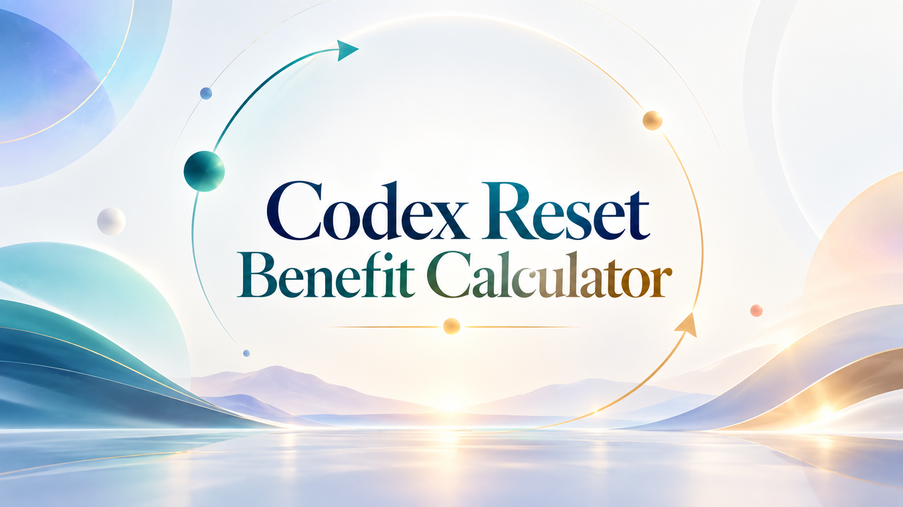
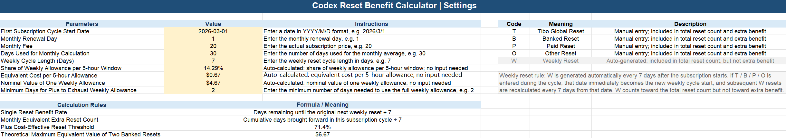
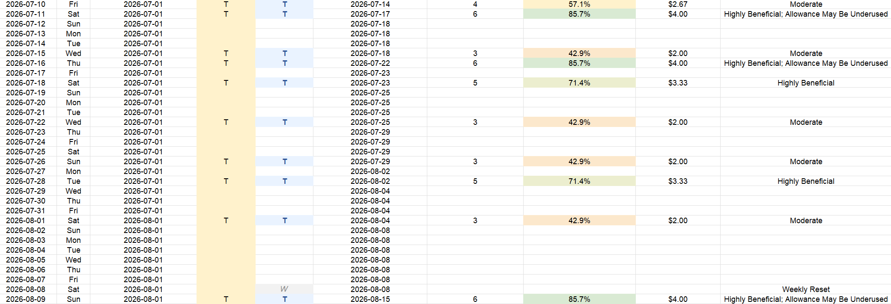
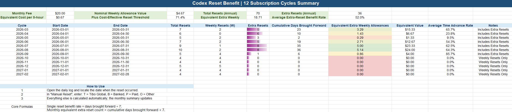

# Codex Reset Benefit Calculator



> A transparent, auditable Excel model for tracking Codex resets, measuring weekly-cycle re-anchoring, and estimating time-equivalent weekly benefit.

[简体中文](./README_CN.md) · [Download Chinese workbook](https://github.com/Nevoria/codex-reset-benefit-calculator/releases/latest/download/codex-reset-benefit-calculator-cn.xlsx) · [Download English workbook](https://github.com/Nevoria/codex-reset-benefit-calculator/releases/latest/download/codex-reset-benefit-calculator-en.xlsx)

   

## The key idea

**An extra reset is not a free, fully independent seven-day allowance.**

In this model, a manual `T / B / P / O` reset means:

1. a new allowance window becomes available immediately;
2. that date becomes the new weekly-cycle anchor;
3. future natural weekly resets (`W`) are recalculated every seven days from the new anchor;
4. the basic benefit is measured by how many days the reset brought availability forward relative to the originally expected `W`, rather than being counted as `+1 full week`.

So this project is not just a reset counter. It separates two questions:

- **How much time did this reset bring forward?**
- **Did the reset arrive so early that the previous allowance may not have been fully used yet?**

Those are different questions. **A high time-equivalent benefit does not automatically mean the same amount of real net benefit.**

## Why measure reset benefit?

Plus usage is shaped by two clocks:

- a configurable weekly reset cycle, set to 7 days by default;
- a separate usage cap for each 5-hour window.

Therefore, an earlier reset always produces a higher **time-equivalent** percentage because it is farther away from the originally expected `W`. But if the reset arrives before the previous weekly allowance could theoretically have been exhausted, its practical value may not keep increasing at the same rate.

With the default assumptions:

- weekly cycle: 7 days;
- minimum time to exhaust one weekly allowance: 2 days.

A reset two days after the previous anchor is 5 days early, so its time-equivalent benefit is `5 ÷ 7 = 71.4%`. This is the default **Plus Cost-Effective Reset Threshold**.

If another reset happens after only one day, it is 6 days early and the time-equivalent benefit is `85.7%`. That 85.7% is valid and should not be capped at 71.4%. However, because the previous allowance had only one day to be used, the `Rating` column warns that the reset is **highly beneficial, but the previous allowance may be underused**.

## How the mechanism works

### 1. An extra reset becomes the new weekly anchor

Suppose the original cycle is:

```text
Sep 4 ───────── Sep 11 W ───────── Sep 18 W
```

If a `T` reset occurs on Sep 8, the workbook records Sep 8 as the new anchor and moves future `W` events seven days at a time from that date:

```text
Sep 4 ─── Sep 8 T ───────── Sep 15 W ───────── Sep 22 W
```

Compared with the originally expected Sep 11 reset, Sep 8 brought availability forward by 3 days. But the next `W` is now Sep 15, not the old calendar date.

A reset is therefore a trade-off between **earlier availability now and a newly scheduled weekly cycle**, not a permanently free extra week.

### 2. Time-Equivalent Benefit Rate

For each manually entered extra reset, the workbook calculates:

```text
Days brought forward = Originally expected next W − Actual extra reset date
Time-Equivalent Benefit Rate = Days brought forward ÷ Weekly cycle length
```

With the default 7-day cycle:

| Time before original W | Days brought forward | Time-Equivalent Benefit Rate |
| --- | ---: | ---: |
| 1 day | 1 | 14.3% |
| 3 days | 3 | 42.9% |
| 5 days | 5 | 71.4% |
| 6 days | 6 | 85.7% |
| 7 days | 7 | 100.0% |

This percentage answers only one question:

> **What fraction of the weekly cycle was brought forward by this reset?**

So `85.7%` and even `100%` are valid values. They are not errors, and they are not forced back down to 71.4%.

### 3. Plus Cost-Effective Reset Threshold

The **Plus Cost-Effective Reset Threshold** in `Settings` is derived from:

```text
Plus Cost-Effective Reset Threshold
= (Weekly cycle length − Minimum days to exhaust weekly allowance)
  ÷ Weekly cycle length
```

With the default assumptions:

```text
Weekly cycle = 7 days
Minimum exhaustion time = 2 days

(7 − 2) ÷ 7 = 71.4%
```

**71.4% is not the maximum possible benefit rate and is not a hard cap.**

It is a reference boundary:

- when the time-equivalent benefit is **at or below** the threshold, at least the configured minimum exhaustion time has passed since the previous anchor;
- when the time-equivalent benefit is **above** the threshold, the reset happened sooner than that minimum time, so the previous allowance may not have been fully used.

This is only a time-based warning. The workbook does not know the real remaining allowance, so it cannot treat this as an actual loss rate.

### 4. How to read the `Rating` column

Column `J` in `Daily Records` remains a **Rating** column. It turns the time-equivalent benefit and very-early-reset condition into a short, readable interpretation.

With the default settings, the logic can be read approximately as:

| Situation | Typical time-equivalent benefit | Meaning |
| --- | ---: | --- |
| Natural weekly reset `W` | — | Weekly Reset |
| Small amount brought forward | below 40% | Low Benefit |
| Moderate amount brought forward | 40% to below 71.4% | Moderate |
| Reaches the default threshold | 71.4% | Highly Beneficial |
| Reset after only one day | 85.7% | Highly Beneficial, but previous allowance may be underused |
| Reset almost immediately | 100% | Very high time benefit, but high previous-allowance underuse risk |

Important:

- “May be underused” does **not** mean that the same percentage of allowance was actually lost.
- The workbook does not know your real remaining balance before the reset.
- If most of the previous allowance had already been consumed, an 85.7% reset may still be extremely valuable.
- If the previous allowance was barely used, the time-equivalent percentage can look very high while the real net value is lower.

In short, column `H` gives the **time-based number**, while column `J` gives the **human-readable interpretation**.

### 5. Equivalent weekly allowances and equivalent value

A `T` reset is not turned directly into `1.00` full extra weekly allowance. The workbook converts cumulative brought-forward time into an equivalent fraction:

```text
Equivalent extra weekly allowances
= Cumulative days brought forward ÷ Weekly cycle length

Equivalent value
= Equivalent extra weekly allowances × Nominal value of one weekly allowance
```

For example, with a $20 monthly fee and 30 days used for the monthly calculation:

```text
Equivalent cost per 5-hour allowance = 20 ÷ 30 ≈ $0.67
Nominal value of one 7-day allowance ≈ 0.67 × 7 ≈ $4.67
Equivalent value of a reset 3 days early ≈ 3 ÷ 7 × 4.67 ≈ $2.00
```

So `3 days early` represents about `0.43` equivalent weekly allowance, not one complete allowance.

**Equivalent value remains time-based and is not automatically reduced by the possibility that the previous allowance was underused.** The reason is simple: the workbook cannot know the real remaining allowance.

## Parameters and assumptions

On `Settings`, the yellow cells are inputs or adjustable parameters; derived values are calculated automatically:

| Parameter | Purpose |
| --- | --- |
| First subscription cycle start date | Starting point for the annual daily timeline |
| Monthly renewal day | Splits the year into 12 subscription cycles instead of assuming calendar months |
| Monthly fee | Used to estimate nominal allowance value; not an official price breakdown |
| Days used for monthly calculation | Denominator for the daily / 5-hour equivalent cost |
| Weekly cycle length | Defaults to 7; drives `W` scheduling and all time ratios |
| Minimum days to exhaust weekly allowance | Defaults to 2; used to derive the Plus Cost-Effective Reset Threshold and interpret very early resets |

The two key formulas are different:

```text
Time-Equivalent Benefit Rate
= Days brought forward ÷ Weekly cycle length

Plus Cost-Effective Reset Threshold
= (Weekly cycle length − Minimum days to exhaust weekly allowance)
  ÷ Weekly cycle length
```

The first is the actual time-equivalent result for each reset. The second is only a reference threshold used for interpretation.

## Workbook screenshots

### Settings: parameters, derived values, and reset codes



### Daily Records: enter manual resets only



### Monthly Summary: review 12 subscription cycles



## Quick start

1. Download and open the [English workbook](./codex-reset-benefit-calculator-en.xlsx).
2. In `Settings`, enter the first cycle start date, monthly renewal day, monthly fee, weekly cycle length, and the estimated minimum days needed to exhaust one weekly allowance.
3. Open `Daily Records` and enter `T`, `B`, `P`, or `O` only in the `Manual Reset` column.
4. Open `Monthly Summary` to review each cycle and the annual totals.

`W` events are generated from the current weekly anchor. Dates, days brought forward, time-equivalent benefit rates, equivalent values, ratings, and summaries update automatically.

## Reset codes

| Code | Meaning | Entry | Total reset | Extra benefit |
| --- | --- | --- | :---: | :---: |
| `W` | Weekly Reset | Automatic | ✅ | ❌ |
| `T` | Tibo Global Reset | Manual | ✅ | ✅ |
| `B` | Banked Reset | Manual | ✅ | ✅ |
| `P` | Paid Reset | Manual | ✅ | ✅ |
| `O` | Other Reset | Manual | ✅ | ✅ |

In the current version, `T/B/P/O` share the same brought-forward-days and time-equivalent logic. The codes classify the logged event; they do not automatically apply different server-side discounts, prices, or real unused-allowance losses.

## Workbook structure

- **Settings**: editable parameters, derived values, the Plus Cost-Effective Reset Threshold, and reset-code definitions.
- **Daily Records**: a full year of dates from the first subscription-cycle start. `Manual Reset` is the only user-input column; column `H` shows the Time-Equivalent Benefit Rate, column `I` shows Equivalent Value, column `J` provides the Rating, and column `K` is a hidden weekly-anchor helper that requires no user action.
- **Monthly Summary**: 12 subscription cycles based on the renewal day, with total resets, natural `W` resets, extra resets, cumulative days brought forward, equivalent weekly allowances, equivalent value, and the Average Time Advance Rate.

The **Average Time Advance Rate** represents the average days brought forward as a share of the weekly cycle. It **does not represent overall real-world value and is not capped at 71.4%**. If extra resets in a cycle happen early enough, values such as `85.7%` are valid.

## Scope and limitations

- This is a **timeline and equivalent-benefit model**, not a live usage viewer.
- It does not connect to Codex or OpenAI accounts, read real 5-hour-window balances, or verify whether a reset succeeded.
- The nominal value of one weekly allowance is derived from the user-entered monthly fee and calculation days; it is not official OpenAI pricing.
- The Time-Equivalent Benefit Rate measures only how much time was brought forward. It is not a measurement of real remaining allowance, real utilization, or real net benefit.
- The Plus Cost-Effective Reset Threshold and the `Rating` are time-based references derived from the user-configured exhaustion assumption, not actual-loss measurements.
- The workbook does not simulate real request volume inside each 5-hour window, model-specific limits, remaining balances, or unused-allowance loss, and it does not automatically deduct potential underuse from Equivalent Value.
- If service rules, cycle semantics, or terminology change, the inputs or formulas may need to be updated.

## Contributing

Issues and pull requests are welcome, especially for:

- reproducible formula or edge-case problems;
- real-world examples from different usage patterns;
- improvements to the re-anchoring model and rating logic;
- documentation, translation, and readability improvements.

## License

[MIT License](./LICENSE)
