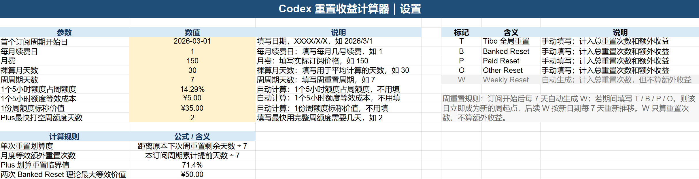
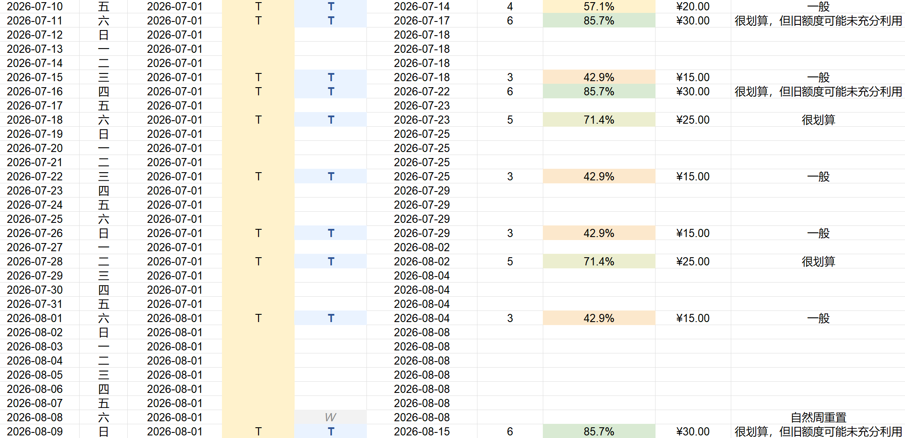
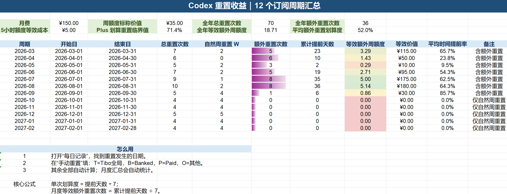

# Codex Reset Benefit Calculator


> 一个透明、可复核的 Excel 模型：记录 Codex Reset，计算周周期重新锚定带来的时间收益，并把它换算成等效周额度与估算价值。

[English](./README.md) · [下载中文版 Excel](https://github.com/Nevoria/codex-reset-benefit-calculator/releases/latest/download/codex-reset-benefit-calculator-cn.xlsx) · [下载 English Excel](https://github.com/Nevoria/codex-reset-benefit-calculator/releases/latest/download/codex-reset-benefit-calculator-en.xlsx)

   

## 核心观点

**一次额外 Reset 不等于凭空多出一份彼此独立的完整 7 天周额度。**

在这个模型里，一次 `T / B / P / O` 额外 Reset 更准确的含义是：

1. 现在立刻获得一次新的可用额度窗口；
2. 这一天同时成为新的周周期锚点；
3. 后续自然周重置 `W` 从这个新锚点重新每 7 天计算；
4. 这次 Reset 的基础收益按它相对原定 `W` 提前了多少天折算，而不是简单记成 `+1 周`。

所以，本项目不是单纯统计“Reset 发生了几次”，而是在回答两个问题：

- **这次 Reset 把可用时间提前了多少？**
- **它虽然来得很早，但旧额度是否可能还没充分利用？**

这两个问题必须分开看。**时间折算划算度可以很高，但它不等于实际净收益。**

## 为什么要计算 Reset 收益？

Plus 用户面对的是两层节奏：

- 周额度按一个可配置的周周期自然重置，默认 7 天；
- 每个 5 小时窗口还有独立的可用量上限。

因此，“更早 Reset”在**时间折算**上一定会得到更高的比例，因为它距离原定 `W` 更远；但如果 Reset 早到连上一份周额度理论上都还来不及用完，那么实际使用价值就不一定继续按同样速度增加。

例如默认设置为：

- 周周期：7 天；
- Plus 最快打空一份周额度：2 天。

如果在上一次锚点后第 2 天发生 Reset，相当于提前 5 天，时间折算划算度为 `5 ÷ 7 = 71.4%`。这正好是默认的 **Plus 划算重置临界值**。

如果只过 1 天就再次 Reset，则会提前 6 天，时间折算划算度为 `85.7%`。这个 85.7% 是有效的时间收益，**不应该被压回 71.4%**；但因为只给旧额度留下了 1 天使用时间，工作簿会在“评价”中提醒：**很划算，但旧额度可能未充分利用**。

## 背后的机制

### 1. 额外 Reset 会重置周周期锚点

假设原本的周期是：

```text
9/4 ───────── 9/11 W ───────── 9/18 W
```

如果 9/8 发生 `T`，工作簿会把 9/8 记录为新的周锚点，后续 `W` 按新的锚点每 7 天推移：

```text
9/4 ─── 9/8 T ───────── 9/15 W ───────── 9/22 W
```

相对于原本即将到来的 9/11，9/8 这次 Reset 提前了 3 天；但新的下一个 `W` 是 9/15，而不是继续沿用旧日历。

因此，Reset 的价值不是“永久多出一个免费的周”，而是一次**提前可用 + 周周期重新排程**。

### 2. 单次时间折算划算度

工作簿对单次额外 Reset 的基础计算是：

```text
提前天数 = 原本下一次 W 日期 − 实际额外 Reset 日期
单次时间折算划算度 = 提前天数 ÷ 周周期天数
```

以默认 7 天周期为例：

| 距离原定 W | 提前天数 | 单次时间折算划算度 |
| --- | ---: | ---: |
| 还有 1 天 | 1 | 14.3% |
| 还有 3 天 | 3 | 42.9% |
| 还有 5 天 | 5 | 71.4% |
| 还有 6 天 | 6 | 85.7% |
| 还有 7 天 | 7 | 100.0% |

这里的百分比只回答一个问题：

> **这次 Reset 相比原定 W，把可用时间提前了整个周周期的多少比例？**

所以 `85.7%`、甚至 `100%` 都是允许出现的。它们不是错误值，也不会被强制封顶到 71.4%。

### 3. Plus 划算重置临界值

「设置」中的 **Plus 划算重置临界值**按下面的假设计算：

```text
Plus 划算重置临界值
= (周周期天数 − Plus 最快打空周额度天数) ÷ 周周期天数
```

默认参数：

```text
周周期 = 7 天
最快打空周额度 = 2 天

(7 − 2) ÷ 7 = 71.4%
```

**71.4% 不是单次划算度的最大值，也不是硬性上限。**

它只是一个用于评价“Reset 是否已经早到可能来不及充分使用旧额度”的参考临界点：

- 当时间折算划算度 **低于或等于**该临界值时，从上一次锚点到这次 Reset，理论上至少留出了“最快打空一份周额度”所需的时间；
- 当时间折算划算度 **高于**该临界值时，Reset 来得比这个最短耗尽时间还早，旧额度存在“可能还没充分利用”的情况。

这个判断只基于时间，不知道你的真实剩余额度，因此**不能把它当成实际损失率**。

### 4. “评价”列怎么看？

「每日记录」中的 `J` 列仍然是**评价**，用于把“时间折算划算度”和“超早 Reset 的潜在未充分利用情况”用一句话说明。

默认逻辑可以这样理解：

| 情况 | 典型时间折算划算度 | 评价含义 |
| --- | ---: | --- |
| 自然周重置 `W` | — | 自然周重置 |
| 提前幅度较小 | 0%～40% 以下 | 收益较低 |
| 中等提前 | 40%～71.4% 以下 | 一般 |
| 达到默认临界值 | 71.4% | 很划算 |
| 只过 1 天又 Reset | 85.7% | 很划算，但旧额度可能未充分利用 |
| 几乎同日再次 Reset | 100% | 时间收益极高，但旧额度利用风险高 |

注意：

- “可能未充分利用”不代表你一定损失了对应比例的额度；
- 工作簿不知道 Reset 前还剩多少真实额度；
- 如果上一份额度已经提前用得差不多，那么即使 85.7% 也可能非常划算；
- 如果旧额度几乎没动，那么时间折算很高，但实际净价值可能没有百分比看起来那么高。

因此，`H` 列负责给出**时间收益数字**，`J` 列负责给出**更容易理解的评价提示**。

### 5. 等效周额度与等效价值

工作簿不会把一次 `T` 直接记成 `1.00` 份完整额外周额度，而是按累计提前时间折算：

```text
等效额外周额度 = 累计提前天数 ÷ 周周期天数
等效价值 = 等效额外周额度 × 一份周额度的名义价值
```

例如月费为 ¥150、按 30 天折算时：

```text
5 小时额度等效成本 = 150 ÷ 30 = ¥5
一份 7 天周额度名义价值 = 5 × 7 = ¥35
提前 3 天的 Reset 等效价值 = 3 ÷ 7 × 35 = ¥15
```

因此，`提前 3 天`应理解为约 `0.43` 份等效周额度，而不是完整 `1` 份。

**等效价值仍然按时间折算计算，不会因为“旧额度可能未充分利用”而自动扣减。** 原因是实际剩余额度未知，工作簿无法可靠计算真实损失。

## 模型参数与假设

「设置」页中，黄色单元格是输入或可调整参数，自动计算项不需要手动修改：

| 参数 | 用途 |
| --- | --- |
| 首个订阅周期开始日 | 生成全年每日时间轴的起点 |
| 每月续费日 | 划分 12 个订阅周期，而不是强制按自然月划分 |
| 月费 | 用于估算额度的名义价值，不代表官方价格拆分 |
| 裸算月天数 | 将月费折算为每日 / 5 小时额度等效成本的分母 |
| 周周期天数 | 默认 7；决定 `W` 推移和所有时间比例 |
| Plus 最快打空周额度天数 | 默认 2；用于推导 Plus 划算重置临界值，并帮助解释超早 Reset |

需要特别区分：

```text
单次时间折算划算度
= 提前天数 ÷ 周周期天数

Plus 划算重置临界值
= (周周期天数 − 最快打空周额度天数) ÷ 周周期天数
```

前者是每次 Reset 的实际时间折算结果；后者只是一个用于评价的参考临界值。

## 工作簿截图

### 设置：参数、自动计算项与 Reset 标记



### 每日记录：只填写手动重置列



### 月度汇总：查看 12 个订阅周期的结果



## 使用方法

1. 下载并打开 [中文版 Excel](./codex-reset-benefit-calculator-cn.xlsx)。
2. 在「设置」填写首个订阅周期开始日、每月续费日、月费、周周期天数和预计最快用完周额度的天数。
3. 打开「每日记录」，只在「手动重置」列填写 `T`、`B`、`P` 或 `O`。
4. 打开「月度汇总」，查看每个订阅周期和全年累计结果。

`W` 会根据当前周锚点自动生成；其他日期、提前天数、时间折算划算度、等效价值、评价和汇总数据都会自动更新。

## Reset 标记

| 标记 | 含义 | 录入方式 | 总重置次数 | 额外收益 |
| --- | --- | --- | :---: | :---: |
| `W` | Weekly Reset，自然周重置 | 自动 | ✅ | ❌ |
| `T` | Tibo Global Reset | 手动 | ✅ | ✅ |
| `B` | Banked Reset | 手动 | ✅ | ✅ |
| `P` | Paid Reset | 手动 | ✅ | ✅ |
| `O` | Other Reset | 手动 | ✅ | ✅ |

当前版本对 `T/B/P/O` 使用同一套“提前天数”与时间折算逻辑；标记主要用于记录事件来源和分类，不会自动套用不同的服务端折扣、价格或真实额度损失。

## 三个工作表分别做什么？

- **设置**：维护计算参数、自动派生值、Plus 划算重置临界值和标记说明。
- **每日记录**：覆盖首个订阅周期开始日起的一整年；`D` 列是唯一需要手动填写的输入列，`H` 列显示单次时间折算划算度，`I` 列显示等效价值，`J` 列给出评价；`K` 列是隐藏的周锚点辅助列，用户无需操作。
- **月度汇总**：按每月续费日划分 12 个订阅周期，统计总重置、自然 `W`、额外 Reset、累计提前天数、等效额外周额度、等效价值和平均时间提前率。

月度汇总中的**平均时间提前率**表示该周期额外 Reset 的平均提前天数占周周期的比例，**不代表实际综合价值，也不以 71.4% 封顶**。如果一个周期内的额外 Reset 平均提前幅度足够大，出现 `85.7%` 等更高结果是正常的。

## 口径与限制

- 这是一个**时间轴与等效收益模型**，不是实时额度读取器。
- 它不连接 Codex 或 OpenAI 账号，不读取真实 5 小时窗口余量，也不验证 Reset 是否成功。
- “一份周额度的名义价值”由你在设置页填写的月费和折算天数推导，不是 OpenAI 官方定价。
- 单次时间折算划算度只衡量“提前了多少天”，不代表真实剩余额度、真实使用率或实际净收益。
- “Plus 划算重置临界值”和“评价”只根据时间与用户设置的最快耗尽天数提供参考，不是实际损失测量。
- 工作簿不会模拟每个 5 小时窗口中的真实请求量、模型差异、剩余额度或未用额度损失，也不会把潜在未充分利用风险自动从等效价值中扣除。
- 未来服务规则、周期口径和术语如果发生变化，需要相应调整参数或公式。

## 参与改进

欢迎提交 Issue 或 Pull Request，尤其欢迎：

- 可复现的公式或边界问题；
- 不同使用速度下的真实案例；
- 对周期重锚定模型和评价逻辑的改进建议；
- 文档、翻译和可读性改进。

## License

[MIT License](./LICENSE)
